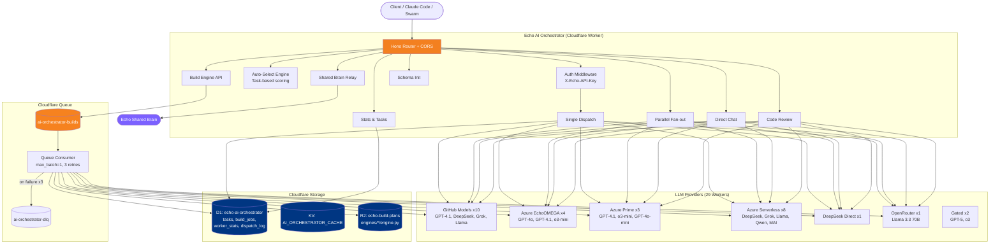

# :brain: Echo AI Orchestrator

**Smart multi-LLM dispatch across 29 workers on Cloudflare Workers.**

[](https://workers.cloudflare.com)
[](https://www.typescriptlang.org)
[](https://hono.dev)
[](LICENSE)

Echo AI Orchestrator is a Cloudflare Worker that provides a unified gateway for dispatching prompts to 29 LLM workers across 7 providers. It features intelligent auto-selection, parallel fan-out, queue-backed async engine builds, code review, direct chat, relay to shared memory, and full telemetry via D1.

**Live URL:** `https://echo-ai-orchestrator.bmcii1976.workers.dev`

---

## Table of Contents

- [Architecture](#architecture)
- [LLM Workers](#llm-workers)
- [Auto-Selection Algorithm](#auto-selection-algorithm)
- [API Reference](#api-reference)
  - [GET /](#get-)
  - [GET /health](#get-health)
  - [GET /workers](#get-workers)
  - [GET /models](#get-models)
  - [POST /auto-select](#post-auto-select)
  - [POST /dispatch](#post-dispatch)
  - [POST /dispatch-parallel](#post-dispatch-parallel)
  - [POST /chat](#post-chat)
  - [POST /review](#post-review)
  - [POST /build-engine](#post-build-engine)
  - [GET /build-engine/:jobId](#get-build-enginejobid)
  - [POST /relay](#post-relay)
  - [GET /stats](#get-stats)
  - [GET /tasks](#get-tasks)
  - [GET /tasks/:id](#get-tasksid)
  - [POST /init-schema](#post-init-schema)
- [Infrastructure](#infrastructure)
- [Secrets](#secrets)
- [Deployment](#deployment)
- [Development](#development)
- [Project Structure](#project-structure)
- [License](#license)

---

## Architecture



### Request Flow

1. **Client** sends a request to any endpoint.
2. **Auth middleware** checks the `X-Echo-API-Key` header on write endpoints (`/dispatch`).
3. **Router** dispatches to the appropriate handler.
4. **Handler** resolves the target LLM worker(s), builds the appropriate prompt, and calls the provider API.
5. **Telemetry** is written to D1 (`tasks`, `worker_stats`, `dispatch_log`).
6. For **builds**, the request is enqueued to a Cloudflare Queue. The consumer processes it asynchronously, writes generated code to R2, and updates job status in D1.

---

## LLM Workers

29 LLM workers across 7 providers. 27 are ready; 2 are gated (require additional access).

| # | ID | Model | Provider | Max Tokens | Strengths | Status |
|---|-----|-------|----------|-----------|-----------|--------|
| 1 | `gpt-4.1` | `openai/gpt-4.1` | GitHub Models | 8,192 | coding, instruction following, top tier | Ready |
| 2 | `gpt-4.1-mini` | `openai/gpt-4.1-mini` | GitHub Models | 8,192 | fast, coding, cost-effective | Ready |
| 3 | `gpt-4.1-nano` | `openai/gpt-4.1-nano` | GitHub Models | 4,096 | fastest, lightweight, bulk processing | Ready |
| 4 | `deepseek-v3` | `deepseek/DeepSeek-V3-0324` | GitHub Models | 8,192 | coding, python, function calling | Ready |
| 5 | `deepseek-r1` | `deepseek/DeepSeek-R1-0528` | GitHub Models | 8,192 | deep reasoning, chain-of-thought, math | Ready |
| 6 | `grok-3` | `xai/grok-3` | GitHub Models | 8,192 | complex reasoning, system-level | Ready |
| 7 | `grok-3-mini` | `xai/grok-3-mini` | GitHub Models | 4,096 | fast reasoning, math, science | Ready |
| 8 | `llama-4-scout` | `meta/Llama-4-Scout-17B-16E-Instruct` | GitHub Models | 4,096 | summarization, code analysis, multilingual | Ready |
| 9 | `llama-405b` | `meta/Meta-Llama-3.1-405B-Instruct` | GitHub Models | 4,096 | large model, versatile, enterprise QA | Ready |
| 10 | `gpt-4o` | `openai/gpt-4o` | GitHub Models | 8,192 | multimodal, vision, legacy compatibility | Ready |
| 11 | `gpt-5` | `openai/gpt-5` | GitHub Models | 16,384 | frontier reasoning, multi-step | **Gated** |
| 12 | `o3` | `openai/o3` | GitHub Models | 8,192 | deep reasoning, math, logic | **Gated** |
| 13 | `deepseek-direct` | `deepseek-chat` | DeepSeek Direct | 8,192 | coding, python, fast | Ready |
| 14 | `openrouter` | `meta-llama/llama-3.3-70b-instruct:free` | OpenRouter | 4,096 | free, bulk tasks, parallel execution | Ready |
| 15 | `azure-gpt4o` | `gpt-4o` | Azure EchoOMEGA | 8,192 | multimodal, vision, reliable | Ready |
| 16 | `azure-gpt41` | `gpt-4.1` | Azure EchoOMEGA | 16,384 | coding, instruction following, top tier | Ready |
| 17 | `azure-gpt41-mini` | `gpt-4.1-mini` | Azure EchoOMEGA | 8,192 | fast, coding, cost-effective | Ready |
| 18 | `azure-o3-mini` | `o3-mini` | Azure EchoOMEGA | 8,192 | deep reasoning, math, logic | Ready |
| 19 | `azure-prime-gpt41` | `gpt-4.1` | Azure Prime | 16,384 | coding, backup | Ready |
| 20 | `azure-prime-o3-mini` | `o3-mini` | Azure Prime | 8,192 | reasoning, backup | Ready |
| 21 | `azure-prime-gpt4o-mini` | `gpt-4o-mini` | Azure Prime | 8,192 | fast, cheap, bulk tasks | Ready |
| 22 | `azure-deepseek-v3` | `DeepSeek-V3-0324` | Azure Serverless | 8,192 | coding, python, fast | Ready |
| 23 | `azure-deepseek-r1` | `DeepSeek-R1` | Azure Serverless | 8,192 | deep reasoning, math, logic | Ready |
| 24 | `azure-grok3` | `grok-3` | Azure Serverless | 8,192 | reasoning, complex tasks | Ready |
| 25 | `azure-grok3-mini` | `grok-3-mini` | Azure Serverless | 4,096 | fast reasoning, math | Ready |
| 26 | `azure-llama33-70b` | `Llama-3.3-70B-Instruct` | Azure Serverless | 4,096 | versatile, multilingual | Ready |
| 27 | `azure-llama4-scout` | `Llama-4-Scout-17B-16E-Instruct` | Azure Serverless | 4,096 | summarization, analysis | Ready |
| 28 | `azure-mai-ds-r1` | `MAI-DS-R1` | Azure Serverless | 8,192 | reasoning, microsoft tuned | Ready |
| 29 | `azure-qwen3-32b` | `qwen-3-32b` | Azure Serverless | 4,096 | coding, multilingual | Ready |

### Provider Summary

| Provider | Count | Auth Method | Cost |
|----------|-------|-------------|------|
| GitHub Models | 10 (+ 2 gated) | Bearer (GITHUB_TOKEN) | Free |
| Azure EchoOMEGA (eastus) | 4 | api-key header | Free tier |
| Azure Prime (eastus2) | 3 | api-key header | Free tier |
| Azure Serverless (AI Foundry) | 8 | api-key header | Free |
| DeepSeek Direct | 1 | Bearer | Free tier |
| OpenRouter | 1 | Bearer | Free |

---

## Auto-Selection Algorithm

The `/auto-select` endpoint scores every ready worker against the requested task type using a weighted heuristic.

### Scoring Rules

| Condition | Points | Triggered By |
|-----------|--------|-------------|
| Worker strength matches `coding` | +10 | Task contains: `cod`, `build`, `program`, `engine`, `python`, `script` |
| Model is GPT-4.1 or DeepSeek | +5 | (same as above) |
| Worker strength is `top tier` | +3 | (same as above) |
| Worker has `reasoning: true` | +15 | Task contains: `reason`, `math`, `logic`, `analyze` |
| Worker strength matches `reasoning`/`math` | +10 | (same as above) |
| Worker strength matches `fast`/`fastest` | +10 | Task contains: `fast`, `bulk`, `quick`, `simple` |
| Model is `mini` or `nano` | +5 | (same as above) |
| Worker strength matches `summarization`/`analysis` | +8 | Task contains: `summar`, `review`, `extract` |
| Worker strength matches `multimodal`/`vision` | +15 | Task contains: `image`, `vision`, `multimodal` |
| Azure dedicated provider | +3 | Always |
| GitHub Models provider | +2 | Always |
| Other providers | +1 | Always |
| Recent error count > 10 | -5 | Per-worker error tracking |
| Recent error count > 50 | -10 | Per-worker error tracking |

Workers are sorted by descending score. The top N are returned as recommendations.

---

## API Reference

All endpoints return JSON. Base URL: `https://echo-ai-orchestrator.bmcii1976.workers.dev`

### Authentication

Write endpoints accept an optional `X-Echo-API-Key` header. If provided, the value must match the `ECHO_API_KEY` secret. Read endpoints are open.

---

### GET /

Service discovery and endpoint listing.

```bash
curl https://echo-ai-orchestrator.bmcii1976.workers.dev/
```

**Response:**

```json
{
  "service": "echo-ai-orchestrator",
  "version": "1.0.0",
  "description": "ECHO PRIME Multi-AI Orchestrator \u2014 30 LLM workers, smart dispatch, async builds",
  "endpoints": [
    "GET  /health",
    "GET  /workers",
    "GET  /models",
    "POST /auto-select",
    "GET  /auto-select?task=coding",
    "POST /dispatch",
    "POST /dispatch-parallel",
    "POST /chat",
    "POST /review",
    "POST /build-engine",
    "GET  /build-engine/:jobId",
    "POST /relay",
    "GET  /stats",
    "GET  /tasks",
    "GET  /tasks/:id",
    "POST /init-schema"
  ]
}
```

---

### GET /health

System health check with worker and task counts.

```bash
curl https://echo-ai-orchestrator.bmcii1976.workers.dev/health
```

**Response:**

```json
{
  "status": "operational",
  "service": "echo-ai-orchestrator",
  "version": "1.0.0",
  "workers_total": 29,
  "workers_ready": 27,
  "tasks_total": 1482,
  "builds_total": 96,
  "uptime": "cloudflare-worker"
}
```

---

### GET /workers

List all 29 LLM workers with provider, model, capability, and key availability.

```bash
curl https://echo-ai-orchestrator.bmcii1976.workers.dev/workers
```

**Response (truncated):**

```json
[
  {
    "id": "gpt-4.1",
    "name": "GPT-4.1 (GitHub Models FREE)",
    "model": "openai/gpt-4.1",
    "provider": "github-models",
    "hasKey": true,
    "strengths": ["coding", "instruction following", "reliable", "top tier"],
    "status": "ready",
    "reasoning": false,
    "serverless": false
  },
  ...
]
```

---

### GET /models

Workers grouped by provider with ready/total counts.

```bash
curl https://echo-ai-orchestrator.bmcii1976.workers.dev/models
```

**Response:**

```json
{
  "total": 29,
  "ready": 27,
  "groups": {
    "github-models": [...],
    "deepseek-direct": [...],
    "openrouter": [...],
    "azure-echoomega": [...],
    "azure-prime": [...],
    "azure-serverless": [...]
  }
}
```

---

### POST /auto-select

Get ranked worker recommendations for a given task type.

```bash
curl -X POST https://echo-ai-orchestrator.bmcii1976.workers.dev/auto-select \
  -H "Content-Type: application/json" \
  -d '{"task": "coding python fastapi engine", "limit": 3}'
```

**Request Body:**

| Field | Type | Required | Description |
|-------|------|----------|-------------|
| `task` | string | Yes | Natural language description of the task |
| `limit` | number | No | Max results to return (default: 5) |

**Response:**

```json
{
  "task": "coding python fastapi engine",
  "recommendations": [
    { "id": "azure-gpt41", "name": "GPT-4.1 (Azure EchoOMEGA)", "model": "gpt-4.1", "score": 21, "provider": "azure-echoomega" },
    { "id": "gpt-4.1", "name": "GPT-4.1 (GitHub Models FREE)", "model": "openai/gpt-4.1", "score": 19, "provider": "github-models" },
    { "id": "deepseek-v3", "name": "DeepSeek-V3-0324 (GitHub Models FREE)", "model": "deepseek/DeepSeek-V3-0324", "score": 17, "provider": "github-models" }
  ]
}
```

Also available as GET for backward compatibility:

```bash
curl "https://echo-ai-orchestrator.bmcii1976.workers.dev/auto-select?task=reasoning+math"
```

---

### POST /dispatch

Dispatch a single task to a specific worker. This is the primary endpoint for sending prompts.

```bash
curl -X POST https://echo-ai-orchestrator.bmcii1976.workers.dev/dispatch \
  -H "Content-Type: application/json" \
  -H "X-Echo-API-Key: YOUR_KEY" \
  -d '{
    "worker": "gpt-4.1",
    "task": "Write a Python function that calculates compound interest with type hints and docstring.",
    "context": "For a financial calculator module."
  }'
```

**Request Body:**

| Field | Type | Required | Description |
|-------|------|----------|-------------|
| `worker` | string | Yes | Worker ID (e.g., `gpt-4.1`, `azure-gpt41`) |
| `task` | string | Yes | The prompt / task description |
| `context` | string | No | Additional system context |
| `model` | string | No | Override the default model for this worker |
| `maxTokens` | number | No | Override max output tokens |

**Response (200):**

```json
{
  "taskId": "task_1740000000000_abc123",
  "status": "completed",
  "worker": "GPT-4.1 (GitHub Models FREE)",
  "model": "openai/gpt-4.1",
  "elapsed_ms": 3421,
  "outputLength": 847,
  "usage": {
    "prompt_tokens": 142,
    "completion_tokens": 312,
    "total_tokens": 454
  },
  "preview": "def compound_interest(principal: float, rate: float, ...",
  "content": "def compound_interest(principal: float, rate: float, ..."
}
```

**Response (500) on failure:**

```json
{
  "taskId": "task_1740000000000_abc123",
  "status": "failed",
  "error": "GPT-4.1 (GitHub Models FREE) API error 429: rate limit exceeded"
}
```

---

### POST /dispatch-parallel

Fan-out the same task to multiple workers simultaneously. Useful for comparing outputs or getting consensus.

```bash
curl -X POST https://echo-ai-orchestrator.bmcii1976.workers.dev/dispatch-parallel \
  -H "Content-Type: application/json" \
  -d '{
    "workers": ["gpt-4.1", "deepseek-v3", "azure-gpt41"],
    "task": "Explain the difference between async and threading in Python.",
    "context": "For a senior developer audience."
  }'
```

**Request Body:**

| Field | Type | Required | Description |
|-------|------|----------|-------------|
| `workers` | string[] | Yes | Array of worker IDs |
| `task` | string | Yes | The prompt to send to all workers |
| `context` | string | No | Additional system context |

**Response:**

```json
{
  "task": "Explain the difference between async and threading in Python.",
  "results": [
    { "worker": "gpt-4.1", "status": "completed", "model": "openai/gpt-4.1", "elapsed_ms": 2891, "outputLength": 1204, "preview": "..." },
    { "worker": "deepseek-v3", "status": "completed", "model": "deepseek/DeepSeek-V3-0324", "elapsed_ms": 1987, "outputLength": 963, "preview": "..." },
    { "worker": "azure-gpt41", "status": "completed", "model": "gpt-4.1", "elapsed_ms": 3102, "outputLength": 1087, "preview": "..." }
  ]
}
```

---

### POST /chat

Direct multi-turn conversation with a worker. Accepts full message history.

```bash
curl -X POST https://echo-ai-orchestrator.bmcii1976.workers.dev/chat \
  -H "Content-Type: application/json" \
  -d '{
    "worker": "gpt-4.1",
    "messages": [
      { "role": "system", "content": "You are a Python expert." },
      { "role": "user", "content": "What is a decorator?" },
      { "role": "assistant", "content": "A decorator is a function that wraps another function..." },
      { "role": "user", "content": "Show me a caching decorator example." }
    ]
  }'
```

**Request Body:**

| Field | Type | Required | Description |
|-------|------|----------|-------------|
| `worker` | string | Yes | Worker ID |
| `messages` | ChatMessage[] | Yes | Array of `{role, content}` objects |
| `model` | string | No | Override model |

**Response:**

```json
{
  "worker": "gpt-4.1",
  "workerName": "GPT-4.1 (GitHub Models FREE)",
  "content": "Here's a caching decorator using functools.lru_cache...",
  "usage": { "prompt_tokens": 189, "completion_tokens": 267, "total_tokens": 456 },
  "elapsed_ms": 2140,
  "model": "openai/gpt-4.1"
}
```

---

### POST /review

Code review endpoint. Sends code to a worker with a structured review prompt.

```bash
curl -X POST https://echo-ai-orchestrator.bmcii1976.workers.dev/review \
  -H "Content-Type: application/json" \
  -d '{
    "worker": "azure-gpt41",
    "code": "def add(a, b):\n    return a + b",
    "filepath": "utils/math.py",
    "instructions": "Check for type safety and edge cases."
  }'
```

**Request Body:**

| Field | Type | Required | Description |
|-------|------|----------|-------------|
| `worker` | string | Yes | Worker ID |
| `code` | string | Yes | Source code to review |
| `filepath` | string | No | File path for context |
| `instructions` | string | No | Additional review instructions |

**Response:**

```json
{
  "filepath": "utils/math.py",
  "reviewer": "GPT-4.1 (Azure EchoOMEGA)",
  "model": "gpt-4.1",
  "elapsed_ms": 1823,
  "review": "**Quality Score: 4/10**\n\n**Issues:**\n1. No type hints on parameters or return value\n2. No docstring..."
}
```

---

### POST /build-engine

Queue-backed asynchronous engine build. Enqueues a build job to the Cloudflare Queue, which is processed by the queue consumer. The consumer calls an LLM to generate a full TIE-grade engine file, stores the result in R2, and updates job status in D1.

```bash
curl -X POST https://echo-ai-orchestrator.bmcii1976.workers.dev/build-engine \
  -H "Content-Type: application/json" \
  -d '{
    "worker": "azure-gpt41",
    "engineId": "CHEM01",
    "engineName": "Chemical Safety Intelligence Engine",
    "domain": "chemistry",
    "tier": "CHEM",
    "engineDescription": "Handles MSDS lookup, chemical reaction hazard analysis, and safety compliance."
  }'
```

**Request Body:**

| Field | Type | Required | Description |
|-------|------|----------|-------------|
| `worker` | string | Yes | Worker ID to use for the build |
| `engineId` | string | Yes | Unique engine identifier (e.g., `CHEM01`) |
| `engineName` | string | Yes | Human-readable engine name |
| `domain` | string | No | Domain category |
| `tier` | string | No | Tier code (e.g., `CHEM`, `LG`, `TX`) |
| `context` | string | No | Additional build context |
| `engineDescription` | string | No | Detailed description of what the engine does |

**Response (202 Accepted):**

```json
{
  "jobId": "build_1740000000000_xyz789",
  "status": "queued",
  "engineId": "CHEM01",
  "engineName": "Chemical Safety Intelligence Engine",
  "worker": "azure-gpt41",
  "message": "Build queued. Poll GET /build-engine/build_1740000000000_xyz789 for status.",
  "poll_url": "/build-engine/build_1740000000000_xyz789"
}
```

### Queue Processing

The queue consumer (`queue-consumer.ts`) processes each build message:

1. Updates job status to `building` in D1.
2. Constructs a TIE-20 standard build prompt with requirements for FastAPI, Pydantic, loguru, doctrine cache, telemetry, and more.
3. Calls the specified LLM worker with `maxTokens: 16384`.
4. Extracts Python code from markdown fences if present.
5. Stores the generated `engine.py` to R2 at `engines/{engineId}/engine.py`.
6. Updates D1 with completion status, line count, and R2 key.
7. On failure: retries up to 3 times with a 30-second delay, then routes to the dead letter queue.

---

### GET /build-engine/:jobId

Poll the status of a queued or in-progress build job.

```bash
curl https://echo-ai-orchestrator.bmcii1976.workers.dev/build-engine/build_1740000000000_xyz789
```

**Response:**

```json
{
  "id": "build_1740000000000_xyz789",
  "engine_id": "CHEM01",
  "tier": "CHEM",
  "status": "complete",
  "worker_model": "azure-gpt41",
  "lines_generated": 1847,
  "output_r2_key": "engines/CHEM01/engine.py",
  "error": null,
  "created_at": "2026-02-25T06:12:34",
  "completed_at": "2026-02-25T06:13:01"
}
```

Possible `status` values: `queued`, `building`, `complete`, `failed`.

---

### POST /relay

Relay content to the Echo Shared Brain for cross-instance memory storage.

```bash
curl -X POST https://echo-ai-orchestrator.bmcii1976.workers.dev/relay \
  -H "Content-Type: application/json" \
  -d '{
    "content": "DECISION: Switched primary build model from GPT-4.1 to Azure GPT-4.1 for better reliability.",
    "importance": 9,
    "tags": ["decision", "build-pipeline"]
  }'
```

**Request Body:**

| Field | Type | Required | Description |
|-------|------|----------|-------------|
| `content` | string | Yes | Content to store (max 10,000 chars) |
| `instance_id` | string | No | Source instance ID (default: `orchestrator_cloud`) |
| `role` | string | No | Message role (default: `assistant`) |
| `importance` | number | No | Importance score 1-10 (default: 5) |
| `tags` | string[] | No | Tags for categorization (default: `["relay"]`) |

**Response:**

```json
{
  "relayed": true,
  "stored": true,
  "id": "mem_abc123"
}
```

---

### GET /stats

Aggregated usage statistics across all tasks, builds, and workers.

```bash
curl https://echo-ai-orchestrator.bmcii1976.workers.dev/stats
```

**Response:**

```json
{
  "tasks": {
    "total": 1482,
    "completed": 1390,
    "failed": 92,
    "total_tokens_in": 2847291,
    "total_tokens_out": 5182043,
    "avg_latency_ms": 3214.7
  },
  "builds": {
    "total": 96,
    "completed": 89,
    "failed": 7,
    "total_lines": 168432
  },
  "worker_stats": [
    {
      "provider": "github-models",
      "model": "openai/gpt-4.1",
      "total_requests": 412,
      "total_tokens": 1892341,
      "avg_latency_ms": 2847.3,
      "error_count": 12,
      "last_used": "2026-02-25T06:00:00",
      "status": "active"
    }
  ],
  "recent_tasks": [...]
}
```

---

### GET /tasks

Paginated task history with optional status filter.

```bash
# All recent tasks
curl "https://echo-ai-orchestrator.bmcii1976.workers.dev/tasks?limit=20"

# Only failed tasks
curl "https://echo-ai-orchestrator.bmcii1976.workers.dev/tasks?status=failed&limit=10"
```

**Query Parameters:**

| Param | Type | Default | Description |
|-------|------|---------|-------------|
| `limit` | number | 50 | Max results |
| `status` | string | (all) | Filter by status: `pending`, `complete`, `failed` |

**Response:**

```json
{
  "total": 20,
  "tasks": [
    {
      "id": "task_1740000000000_abc123",
      "type": "dispatch",
      "model": "openai/gpt-4.1",
      "provider": "github-models",
      "status": "complete",
      "input": "Write a Python function...",
      "output": "def compound_interest...",
      "tokens_in": 142,
      "tokens_out": 312,
      "latency_ms": 3421,
      "created_at": "2026-02-25T06:00:00",
      "completed_at": "2026-02-25T06:00:03"
    }
  ]
}
```

---

### GET /tasks/:id

Retrieve a single task by ID.

```bash
curl https://echo-ai-orchestrator.bmcii1976.workers.dev/tasks/task_1740000000000_abc123
```

**Response:** Same schema as a single item from `/tasks`.

---

### POST /init-schema

Manually initialize or reset the D1 database schema. Normally this happens automatically on first dispatch, but can be triggered explicitly.

```bash
curl -X POST https://echo-ai-orchestrator.bmcii1976.workers.dev/init-schema
```

**Response:**

```json
{
  "ok": true,
  "message": "Schema initialized"
}
```

---

## Infrastructure

### Cloudflare Bindings

| Binding | Type | Name / ID | Purpose |
|---------|------|-----------|---------|
| `DB` | D1 Database | `echo-ai-orchestrator` (`50f5714c`) | Tasks, build jobs, worker stats, dispatch log |
| `CACHE` | KV Namespace | `AI_ORCHESTRATOR_CACHE` (`d8ef14eb`) | Response caching and hot state |
| `R2` | R2 Bucket | `echo-build-plans` | Built engine files stored at `engines/{id}/engine.py` |
| `BUILD_QUEUE` | Queue (Producer) | `ai-orchestrator-builds` | Async build job queue |
| (Consumer) | Queue (Consumer) | `ai-orchestrator-builds` | Batch size 1, 3 retries, 0s timeout |
| (DLQ) | Dead Letter Queue | `ai-orchestrator-dlq` | Failed builds after 3 retries |

### D1 Schema (4 tables)

**`tasks`** -- All dispatch/chat/review/build task records.

| Column | Type | Description |
|--------|------|-------------|
| `id` | TEXT PK | Task ID (`task_{timestamp}_{random}`) |
| `type` | TEXT | Task type: `dispatch`, `build`, `chat`, `review` |
| `model` | TEXT | LLM model used |
| `provider` | TEXT | Provider name |
| `status` | TEXT | `pending`, `complete`, `failed` |
| `input` | TEXT | Input prompt (truncated to 2,000 chars) |
| `output` | TEXT | Output content (truncated to 5,000 chars) |
| `tokens_in` | INTEGER | Prompt tokens consumed |
| `tokens_out` | INTEGER | Completion tokens generated |
| `latency_ms` | INTEGER | End-to-end latency in milliseconds |
| `created_at` | TEXT | ISO timestamp |
| `completed_at` | TEXT | ISO timestamp (null if pending) |

**`build_jobs`** -- Async engine build tracking.

| Column | Type | Description |
|--------|------|-------------|
| `id` | TEXT PK | Job ID (`build_{timestamp}_{random}`) |
| `engine_id` | TEXT | Engine identifier (e.g., `CHEM01`) |
| `tier` | TEXT | Tier code |
| `status` | TEXT | `queued`, `building`, `complete`, `failed` |
| `worker_model` | TEXT | Worker used |
| `lines_generated` | INTEGER | Lines of code generated |
| `output_r2_key` | TEXT | R2 object key for the built engine |
| `error` | TEXT | Error message if failed |
| `created_at` | TEXT | ISO timestamp |
| `completed_at` | TEXT | ISO timestamp |

**`worker_stats`** -- Per-worker usage aggregation.

| Column | Type | Description |
|--------|------|-------------|
| `provider` | TEXT | Provider name (composite PK) |
| `model` | TEXT | Model name (composite PK) |
| `total_requests` | INTEGER | Total successful requests |
| `total_tokens` | INTEGER | Total tokens consumed |
| `avg_latency_ms` | REAL | Rolling average latency |
| `error_count` | INTEGER | Total errors |
| `last_used` | TEXT | Last activity timestamp |
| `status` | TEXT | `active` |

**`dispatch_log`** -- Auto-selection audit trail.

| Column | Type | Description |
|--------|------|-------------|
| `id` | INTEGER PK | Auto-increment |
| `task_id` | TEXT | Related task ID |
| `provider` | TEXT | Provider considered |
| `model` | TEXT | Model considered |
| `strategy` | TEXT | Selection strategy (e.g., `direct`) |
| `score` | REAL | Auto-select score |
| `selected` | INTEGER | 1 if this worker was chosen |
| `reason` | TEXT | Selection reason |
| `created_at` | TEXT | ISO timestamp |

---

## Secrets

7 secrets must be configured via `wrangler secret put`:

| Secret | Provider | Description |
|--------|----------|-------------|
| `GITHUB_TOKEN` | GitHub Models | GitHub personal access token with models scope |
| `AZURE_ECHOOMEGA_KEY` | Azure EchoOMEGA | Azure OpenAI API key (eastus) |
| `AZURE_PRIME_KEY` | Azure Prime + Serverless | Azure AI API key (eastus2) |
| `DEEPSEEK_API_KEY` | DeepSeek Direct | DeepSeek platform API key |
| `OPENROUTER_API_KEY` | OpenRouter | OpenRouter API key |
| `ECHO_API_KEY` | Internal | Auth key for write endpoints |
| `XAI_API_KEY` | (reserved) | xAI API key (reserved for future use) |

---

## Deployment

### Prerequisites

- [Node.js](https://nodejs.org/) >= 18
- [Wrangler CLI](https://developers.cloudflare.com/workers/wrangler/) >= 4.0
- A Cloudflare account with Workers, D1, KV, R2, and Queues enabled

### Steps

```bash
# 1. Clone the repository
git clone https://github.com/bobmcwilliams4/echo-ai-orchestrator.git
cd echo-ai-orchestrator

# 2. Install dependencies
npm install

# 3. Set secrets (one-time)
echo "YOUR_GITHUB_TOKEN" | npx wrangler secret put GITHUB_TOKEN
echo "YOUR_AZURE_ECHOOMEGA_KEY" | npx wrangler secret put AZURE_ECHOOMEGA_KEY
echo "YOUR_AZURE_PRIME_KEY" | npx wrangler secret put AZURE_PRIME_KEY
echo "YOUR_DEEPSEEK_API_KEY" | npx wrangler secret put DEEPSEEK_API_KEY
echo "YOUR_OPENROUTER_API_KEY" | npx wrangler secret put OPENROUTER_API_KEY
echo "YOUR_ECHO_API_KEY" | npx wrangler secret put ECHO_API_KEY
echo "YOUR_XAI_API_KEY" | npx wrangler secret put XAI_API_KEY

# 4. Deploy
npm run deploy

# 5. Initialize the database schema
curl -X POST https://echo-ai-orchestrator.bmcii1976.workers.dev/init-schema

# 6. Verify
curl https://echo-ai-orchestrator.bmcii1976.workers.dev/health
```

---

## Development

```bash
# Start local dev server (uses wrangler dev with local D1/KV/R2 simulation)
npm run dev

# Tail production logs
npm run tail
```

The worker runs on Wrangler with `nodejs_compat` compatibility flag and targets ES2022.

---

## Project Structure

```
echo-ai-orchestrator/
  src/
    index.ts           # Hono app, all route handlers, auth middleware, D1 helpers
    types.ts           # TypeScript interfaces (Env, WorkerConfig, ChatMessage, etc.)
    providers.ts       # 29 LLM worker definitions, callWorker(), getReadyWorkers()
    auto-select.ts     # Task-based scoring algorithm for worker selection
    queue-consumer.ts  # Cloudflare Queue consumer for async engine builds
  wrangler.toml        # Cloudflare Worker config (D1, KV, R2, Queue bindings)
  tsconfig.json        # TypeScript config (ES2022, strict, bundler resolution)
  package.json         # Dependencies: hono, @cloudflare/workers-types, wrangler
```

---

## License

[MIT](LICENSE)

Copyright (c) 2026 Echo Prime Technologies
